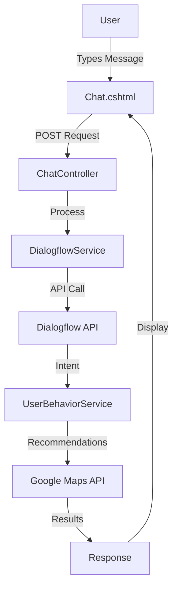

# FoodieSaur - Diagrams and Documentation Guide

This guide provides instructions for viewing and using the system diagrams and documentation.

---

## 📊 Available Diagrams

### 1. Entity Relationship Diagram (ERD)

**File**: `database_erd.dbml`  
**Format**: DBdiagram.io format  
**Purpose**: Complete database schema visualization

**How to View**:
1. Go to [https://dbdiagram.io](https://dbdiagram.io)
2. Click "Create New Diagram"
3. Copy and paste the contents of `database_erd.dbml`
4. The diagram will automatically render showing:
   - All database tables
   - Relationships (1:1, 1:N)
   - Primary keys and foreign keys
   - Indexes
   - Field types and constraints

**What it Shows**:
- **Core User Management**: Users, UserProfiles
- **Food Types & Preferences**: FoodTypes, UserFoodTypes, FoodPreferences
- **Dietary & Health**: DietaryRestrictions, HealthConditions, and their user associations
- **Chat System**: ChatSessions, ChatMessages
- **Behavioral Learning**: UserBehaviors, UserPreferencePatterns
- **Favorites**: UserFavoriteRestaurants

**Export Options** (in DBdiagram.io):
- PNG image
- PDF document
- SQL script
- PostgreSQL/MySQL/MSSQL schema

---

### 2. System Architecture & Data Flow Diagram

**File**: `SYSTEM_ARCHITECTURE_DIAGRAM.md`  
**Format**: Markdown with ASCII art  
**Purpose**: System architecture and data flow visualization

**How to View**:
1. Open `SYSTEM_ARCHITECTURE_DIAGRAM.md` in any markdown viewer
2. Or view directly in GitHub/GitLab
3. For better visualization, copy ASCII diagrams to:
   - [ASCIIFlow](https://asciiflow.com/) for editing
   - [Draw.io](https://app.diagrams.net/) for conversion to visual diagrams
   - [Mermaid Live Editor](https://mermaid.live/) for interactive diagrams

**What it Shows**:
- **System Architecture**: Complete layer structure (Client → Application → Database → External Services)
- **Data Flow: User Authentication**: OAuth and local auth flows
- **Data Flow: Chat Message Processing**: Complete chat message lifecycle
- **Data Flow: Prescriptive Recommendation Algorithm**: Step-by-step algorithm flow
- **Data Flow: Behavior Learning System**: How the system learns from user interactions
- **External API Integration Points**: All external service connections

---

### 3. System Data Flow Diagram (Alternative Format)

**File**: `system_data_flow_diagram.dbml`  
**Format**: DBdiagram.io format (adapted for system architecture)  
**Purpose**: External interfaces and system components visualization

**How to View**:
1. Go to [https://dbdiagram.io](https://dbdiagram.io)
2. Click "Create New Diagram"
3. Copy and paste the contents of `system_data_flow_diagram.dbml`
4. Note: This uses DBdiagram format but represents system components, not database tables

**What it Shows**:
- External systems and interfaces
- Application layers (Presentation, Controller, Service, Data Access)
- Data flow patterns
- System architecture summary

---

## 📚 Documentation Files

### 1. System Documentation

**File**: `SYSTEM_DOCUMENTATION.md`  
**Format**: Markdown  
**Purpose**: Comprehensive system documentation

**Contents**:
- **External Interfaces Requirements**
  - Hardware interfaces (GPS, display, network)
  - External system interfaces (Google Maps, Dialogflow, OAuth, ScrapingBee, SQL Server)
  - Communication interfaces (HTTP/HTTPS, AJAX)
  - User interface (GUI) characteristics and design principles

- **Tech Stack and Tools**
  - Backend technologies (ASP.NET Core, EF Core, etc.)
  - Frontend technologies (TailwindCSS, jQuery, Google Maps JS API)
  - Development environment tools
  - Deployment and hosting information

- **System Architecture**: MVC pattern with service layer
- **Database Schema**: Overview of key entities
- **Data Flow Diagrams**: Summary of key flows

---

## 🎯 Quick Reference

### For Database Design Review
1. Open `database_erd.dbml` in DBdiagram.io
2. Review table structures and relationships
3. Export as SQL if needed for database setup

### For System Architecture Review
1. Open `SYSTEM_ARCHITECTURE_DIAGRAM.md`
2. Review system layers and data flows
3. Use as reference for development and troubleshooting

### For External Integration Setup
1. Open `SYSTEM_DOCUMENTATION.md`
2. Navigate to "External Interfaces Requirements"
3. Follow configuration instructions for each external service

### For Technology Stack Overview
1. Open `SYSTEM_DOCUMENTATION.md`
2. Navigate to "Tech Stack and Tools"
3. Review all technologies, frameworks, and tools used

---

## 🔧 Creating Visual Diagrams from ASCII

### Option 1: Using Draw.io

1. Go to [https://app.diagrams.net](https://app.diagrams.net)
2. Create a new diagram
3. Manually recreate the ASCII diagrams using Draw.io shapes
4. Export as PNG, PDF, or SVG

### Option 2: Using Mermaid

Convert ASCII diagrams to Mermaid syntax:

### Option 3: Using Lucidchart

1. Go to [https://www.lucidchart.com](https://www.lucidchart.com)
2. Create a new diagram
3. Use templates for:
   - System Architecture Diagrams
   - Data Flow Diagrams
   - Entity Relationship Diagrams
4. Import or recreate based on the provided documentation

---

## 📋 Documentation Checklist

Use this checklist when reviewing or updating documentation:

- [ ] Entity Relationship Diagram (`database_erd.dbml`) is up to date
- [ ] System Architecture Diagram (`SYSTEM_ARCHITECTURE_DIAGRAM.md`) reflects current system
- [ ] External Interfaces section lists all integrations
- [ ] Tech Stack section includes all current technologies
- [ ] Data Flow diagrams match actual implementation
- [ ] Configuration examples are accurate
- [ ] API endpoints and authentication methods are documented

---

## 🚀 Using Diagrams in Presentations

### For Academic/Project Presentations

1. **Database ERD**:
   - Export from DBdiagram.io as PNG (high resolution)
   - Include in "Database Design" section
   - Annotate key relationships

2. **System Architecture**:
   - Convert ASCII diagrams to visual format using Draw.io
   - Include in "System Architecture" section
   - Highlight external integrations

3. **Data Flow Diagrams**:
   - Use `SYSTEM_ARCHITECTURE_DIAGRAM.md` as reference
   - Create visual versions for presentation slides
   - Focus on key flows: Authentication, Chat Processing, Recommendations

### For Developer Onboarding

1. Start with `SYSTEM_DOCUMENTATION.md` overview
2. Review `database_erd.dbml` for database structure
3. Study `SYSTEM_ARCHITECTURE_DIAGRAM.md` for system flows
4. Reference external interfaces for API setup

---

## 📝 Updating Documentation

When making system changes:

1. **Database Changes**:
   - Update `database_erd.dbml`
   - Add migration notes if needed
   - Update relationship comments

2. **Architecture Changes**:
   - Update `SYSTEM_ARCHITECTURE_DIAGRAM.md`
   - Update data flow diagrams if processes change
   - Update external interfaces if new APIs are added

3. **Technology Changes**:
   - Update "Tech Stack and Tools" section in `SYSTEM_DOCUMENTATION.md`
   - Update package versions in `.csproj` and `package.json`
   - Document new dependencies

---

## 🔗 Related Documentation Files

- `DESIGN_REFERENCE_GUIDE.md` - UI/UX design guidelines
- `DEVELOPER_QUICK_REFERENCE.md` - Quick development reference
- `DIALOGFLOW_SETUP_GUIDE.md` - Dialogflow integration setup
- `OAUTH_SETUP_GUIDE.md` - OAuth provider configuration
- `FINAL_IMPLEMENTATION_SUMMARY.md` - Implementation status

---

## 💡 Tips

1. **DBdiagram.io Pro Tips**:
   - Use colors to group related tables
   - Add notes to explain complex relationships
   - Export SQL for database creation scripts

2. **ASCII Diagram Tips**:
   - Use monospace fonts for proper alignment
   - Keep diagrams under 80 characters wide for readability
   - Use consistent symbols (│, ├, └, ─, ┬, ┴)

3. **Documentation Tips**:
   - Keep examples up to date with actual code
   - Include version numbers for packages
   - Document configuration requirements clearly

---

**Last Updated**: December 2024  
**Maintained By**: FoodieSaur Development Team

